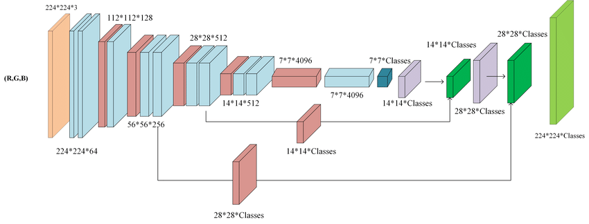
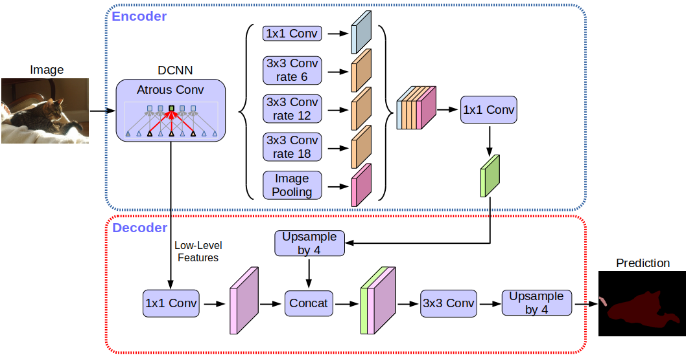

# Underwater Segmentation

Apply Semantic segmenation techniques such as UNet, DeepLab and FCN to water bodies satelite images and deploy using streamlit

## Dataset - [SUIM dataset]
Paper： Semantic Segmentation of Underwater Imagery: Dataset and Benchmark
Dataset introduction: This dataset is an underwater segmentation dataset, which contains already marked segmentation tags. For a detailed introduction of the dataset, please see the detailed introduction on the Homepage.


## How to train the model
```
$ python3 train.py --model unet --epochs 2 --data_path "Underwater_bodies_dataset/train_val" --test_data_path "Underwater_bodies_dataset/TEST"
```
## How to predict(segment) the image
```
$ python3 predict.py -i "Underwater_bodies_dataset/TEST/images/d_r_47_.jpg" 
```

## Architectures

### 1. U-Net


### 2. FCN-8 (Fully Convolutional Network)


### 3. DeepLabV3


## Project Structure

```
.
├── app
│   ├── frontend.py
│   ├── segmenter.py
│   └── saved_images
├── assets
│   ├── deeplab.png
│   ├── fcn.jpg
|   └── ....
├── data
│   └── Water Bodies Dataset
│       ├── Images
│       └── Masks
├── models
│   ├── __init__.py
│   ├── metrics.py
│   ├── datagenerator.py
│   ├── deeplab.py
│   ├── fcn.py
│   └── unet.py
├── saved_models
│   └── unet.pkl
│   └── deeplab.pkl
│   └── fcn.pkl
├── train.py
├── utils.py
├── predict.py
├── check_gpu.py
├── README.md
└── requirements.txt
├── check_gpu.py
├── Graphs
└── ...
```
## Results
### 1. U-Net Testing Accuracy and Training Accuracy Graph for 100 epochs


### 2. FCN-8 (Fully Convolutional Network) Testing Accuracy and Training Accuracy Graph for 75 epochs


### 3. DeepLabV3 Testing Accuracy and Training Accuracy Graph for 150 epochs


## How to use gpu 
```
$ pip install tensorflow[and-cuda]
```
To check the installation of tensorflow cuda run the following command 
```
$ python3 check_gpu.py
```


## Tools
- Python
- Tensorflow-gpu
- streamlit

## References
- [U-Net: Convolutional Networks for Biomedical Image Segmentation](https://arxiv.org/abs/1505.04597v1)
- [Fully Convolutional Networks for Semantic Segmentation](https://arxiv.org/abs/1605.06211v1)
- [Rethinking Atrous Convolution for Semantic Image Segmentation](https://arxiv.org/abs/1706.05587v3)
